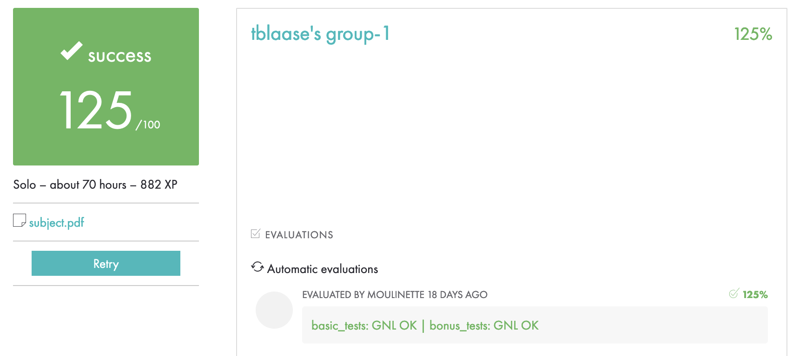
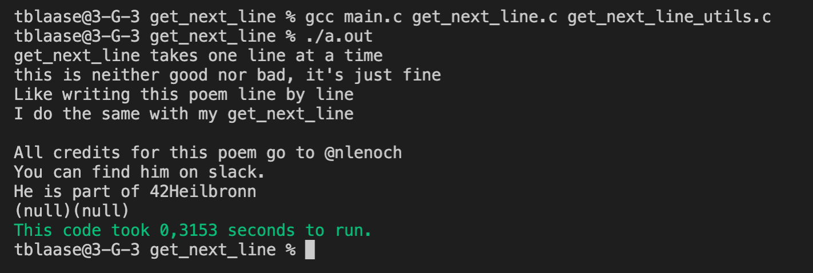

# get_next_line (125/100)



This is a solution for the latest(July 2021) version of the get_next_line project of 42 school.<br>
This code might not be perfect but it is the first piece of code i produced which looks not too bad.<br>
This solution is leak tested with valgrind.<br>
This solution produces no errors with https://github.com/Tripouille/gnlTester, even for the docker test.<br>
This solution uses a total of 9 functions (10 functions is allowed).<br>
The .c-files for the bonus end with _bonus. .<br>
The bonus code has almost no differences from the normal code.<br>
The comments in the bonus part are shorter, so take a look at the normal codes comments instead.<br>
If i made a mistake, which i certainly did, and you spot it, please tell me :)<br>
If anything is not understandable even with the comments, please tell me :)<br>
<br>
<br>compile with:<br>

```
gcc -Wall -Wextra -Werror main.c get_next_line.c get_next_line_utils.c
```

<br>run with:<br>

```
./a.out
```

<br>
Here is an example output i got with the main function and the test.txt i provided.<br>


Please be mindfull and don't just copy paste this code without fully understanding it.<br>
